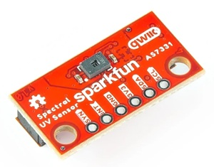

# AS7331 UVA/UVB/UVC Sensor with I2C Interface

For testing, the 'Sparkfun Min Spectral UV Sensor' board was used (SEN-23518).
https://docs.sparkfun.com/SparkFun_Spectral_UV_Sensor_AS7331/introduction/



The AS7331 contains three separate photodiode sensors, for UVA, UVB and UVC ranges of ultraviolet light. Sensor readings are converted via 24-bit delta-sigma A/D converters, and raw 16-bit values are returned for each sensor. It runs on 3.3V and has a standard I2C serial interface.

> [!NOTE]
> This library is used for the "MuUV" project. The MuUV device is a rechargeable UVA/B/C sensor with a 128x64 display, rotary encoder for controlling the configuration menu, USB connection and a Windows Application. This project will appear ~~soon~~ eventually on the https://muman.ch blog, with full source code and schematics. It uses a Seeed Studio XIAO microcontroller (ESP32). Tests are ongoing at high altitudes and at sea level. (Tests below sea level have been inconclusive due to sea water contamination :-)

## What are UVA, UVB and UVC?

These are the names given to three frequency ranges of UV light emitted by the sun.

UVA is the most common. UVA can penetrate the skin down to the middle layer (dermis).

UVB is a shorter wavelength than UVA that can only penetrate the skin's top layer (epidermis). The atmosphere stops about 95% of UVB rays from reaching the surface, depending on the altitude. Treated glass or plastic also stops UVB rays. Stanford Medecine states: _UVB is 3 to 4 orders of magnitude (1,000 to 10,000 times) more potent than UVA!_ (Q. If it only penetrates the epidermis, then why is it so dangerous?)

Almost all UVC is stopped by the Earth's ozone layer and atmosphere. The only exposure humans (and aliens?) get to UVC is from artificial sources, such as lasers, welding torches, nasty weapons, etc. UVC can cause skin burns, eye injury and blindness (see Disclaimer).


### Typical Maximum UVA Levels

**Natural Sunlight** : Surface intensity for UVA around 365 nm is typically less than 0.006 W/cm² (6 mW/cm²). \
**Industrial Inspection / UV Torch** : Safe extended limits are commonly 0.005 W/cm² (5,000 µW/cm²), with some maximum limits capped at 0.01 W/cm² (10,000 µW/cm²). \
**Industrial UV Curing Lamps** : Specialized high-power meters can read intensive application outputs up to 30 W/cm² (30,000,000 µW/cm²).

## What is the UV Index?

The UV Index is a rough measurement of the sunlight's strength, tanning power and associated risks. 

| UV Index  | Description |
|:----------|:----------- |
| 0         | No UV, safe for vampires |
| 1..2      | Low |
| 3..5      | Moderate |
| 6..7      | High |
| 8..10     | Very high |
| 11+       | Extreme, put your clothes back on! |
| 43.3      | Highest level ever recorded * |
| 9999      | Overflow, reduce the gain |

(*) The highest UV Index ever recorded (on Earth) was 43.3, measured at the Licancabur volcano in Bolivia in 2003, because of its extreme altitude and tropical latitude. Sunbathing there is NOT recommended (see Disclaimer).

<br/>

Below is a summary of the AS7331 Data Sheet. Full details are not reproduced here because you can read all about it in the Data Sheet. Page numbers refer to _this_ version of the data sheet (DS001047 v4-00 2023-Mar-24). \
https://look.ams-osram.com/m/1856fd2c69c35605/original/AS7331-Spectral-UVA-B-C-Sensor.pdf

## Configuration p49

The gain, internal clock frequency and conversion time (the number of clocks per sample at the internal clock frequency) can be programmed, to provide a wide range sensitivities and resolutions. It has one 8-bit operating state register (OSR), and three 8-bit configuration registers CREG1..CREG3. Some additional settings are available for special features, see source code.

## Operating States p15

The AS7331 has two operating states. In the CONFIGURATION state the configuration registers are accessed. In the MEASUREMENT state the measurement registers are accessed. Both sets of registers have the same register numbers, so the wrong data will be read if it's in the wrong operating state. After `reset()`, it remains Powered Down in the CONFIGURATION state.

## Energy Saving Options p23

It has two power-saving modes, Power Down and Standby. The data sheet contains all the details, with some "nice" state diagrams.

## Measurements p17

Measurements can be started by an I2C command (CMD mode), continuous sampling (CONT mode), or by the falling edge of an external SYN signal (SYNS mode=start signal, SYND mode=start and end signals) so readings can be synchronized with an external event.

## Polling p17

It is recommended not to send I2C messages while a conversion is in progress. A timer or the chip's READY output can be used to determine when a new reading is available. Both these methods are illustrated in the example application. The READY output can be configured as push-pull or open-drain (GND or floating) by `setConfigCREG3()`. Use open-drain if you have more than one AS7331 which shares the same READY pin. To detect a missing READY signal, configure the input as `INPUT_PULLDOWN`. 

## Divider p39

Although the ADC samples are 24-bits, the raw UV values read from the MRESx registers are only 16-bits. This is fine if the resolution is 10..16 bits, but for 11..24 bit resolutions only the LEAST SIGNIFICANT 16 bits are returned. This means that an overflow error could occur with certain configurations and the readings will be invalid. Because of this, a divider value 'div' can be configured to shift the 24-bit register so the unavailable upper 8 bits will be returned.

## Irradiance Calculations p30 'Transfer Function'

'Irradiance' is measured as the number of Watts-per-square-metre. For low values, milliWatts-per-square-centimeter `mW/cm2` or microWatts-per-square-centimeter `uW/cm2` is used.

To get an idea of what this means, at the Earth's surface on a clear day at solar noon, the total UVA radiation (wavelengths 315–400nm) is roughly 40 to 60 Watts-per-square-meter (W/m2), which is 4..6 milliWatts-per-square-centimeter (mW/cm2), or 4000..6000 microWatts-per-square centimeter (uW/cm2). In the winter, or on a cloudy day, it can be less than 1mW/cm2.

Equation 3 in the data sheet (p30) is used for the irradiance calculations, with full scale ranges `fsrX` and LS bit significance `lsbX` calculated by `calculateCoefficients()` which is called automatically whenever the configuration is changed. Irradiance values are returned in microWatts-per-square-centimeter (uW/cm2). 

The library also calculates the standard UV Index based on the UVA and UVB values, see `calculateUVIndex()`.

Internally calculated values (`fsrX`, `lsbX`, `tconvI` and `nbitsI`) are public and can be read by the application. Do not write to these, unless you are experimenting or testing the algorithms.

## Advantages of this Library

This library provides calculations for the Full Scale Range (FSR) and LS bit significance for the full range of settings. The `calculateCoefficients()` method also detects the many invalid configurations. Calculations can be verified by comparing them with the tables in the data sheet p32..38 (these are for 1.024MHz internal clock only). The other popular libraries (listed below) do not provide the calculations for all configuration ranges, do not use the 'div' setting, do not detect invalid configurations and seem to ignore overflow values.

The library also has better handling of overflow and low value conditions. It will not silently produce invalid results under these conditions.

"Window factors" `wfacX` have been implemented. These are multipliers which compensate for reductions caused by a transparent glass or plastic sensor cover, which is usually fitted to prevent dirt accumulating directly on the UV sensor. The `wfacX` values are easily calibrated by taking a reading without the cover, then a reading with the cover, and dividing the two. e.g. wfac 1.0=no cover, 1.25=with 25% loss. UVA, UVB and UVC may have different wfac values, depending on the cover material.

## AS7331UVSensor Class Reference

Full details of each method can be read from the associated comments in the source code in `AS7331UVSensor.h`. The descriptions are not duplicated here.

If you add `#define DEBUG` before `#include "AS7331UVSensor.h"`, then additional debug code is generated which outputs error messages to `Serial`. Patch out `#define DEBUG` for the release version.

Most methods return `true` on success, or `false` if there's an invalid parameter or communications error, with a message sent to the `Serial` log. Data is usually returned via parameter pointers. This ensures that the program does not continue running blindly if there's a serious error. Many libraries seem to ignore runtime errors, but some use a global error flag (which may be better...) 

In the unlikely event that you need to access an instance of this class from more than one `.cpp` file, split `AS7331UVSensor.h` into two files, one with the class definition (.h) and one with the code (.cpp).

```cpp
class AS7331UVSensor
{
public:
	// Values initialized by calculateCoefficients()
	// do not write to these unless you are experimenting or testing
	float fsrA, fsrB, fsrC;		// full scale range, microWatts per square centimeter, uW/cm2
	float lsbA, lsbB, lsbC;		// sigificance of LS bit, nanoWatts per square centimeter, nW/cm2
	uint tconvI;				// conversion time in milliseconds
	uint nbitsI;				// number of significant bits of conversion (in 24-bit OUTCONV reg)

	// Window factors, set these if the sensor has a glass or plastic cover, each 
	// has a different factor because the window may have different absorbtions
	// needs calibration, default=1.0 (no window glass)
	float wfactA = 1.0f;
	float wfactB = 1.0f;
	float wfactC = 1.0f;

	bool begin(TwoWire* twoWire, uint i2cAddress);
	bool reset();

	//>>> for both CONFIGURATION and MEASUREMENT operating states
	// status bits for testing 'status' value returned by readStatus(), p59
	typedef enum : byte {
		OUTCONVOF    = 0x80,	// overflow of internal bit time counter, OUTCONV
		MRESOF       = 0x40,	// overflow of one or more MRESx 16-bit registers
		ADCOF        = 0x20,	// overflow of one or more ADC channels
		LDATA        = 0x10,	// output buffer overwritten with new value before previous value was read
		NDATA        = 0x08,	// new readings transferred to MRESx registers
		NOTREADY     = 0x04,	// 1=busy, 0=reading available
		STANDBYSTATE = 0x02,	// 1=in standby
		POWERSTATE   = 0x01,	// 1=powered down
		OVERFLOW     = OUTCONVOF | MRESOF | ADCOF
	} AS7221_STATUS;
	bool readStatus(AS7221_STATUS* status);

	bool powerDown() { osr |= 0x40; return writeReg(0x00, osr); }
	bool powerUp() { osr &= ~0x40; return writeReg(0x00, osr); }
	bool stanbyOn() { creg3 &= ~0x10; return writeReg(0x08, creg3); }
	bool standbyOff() { creg3 |= 0x10; return writeReg(0x08, creg3); }

	bool startMeasurement() { return writeReg(0x00, 0x80); }

	typedef enum : byte { 
		INVALID = 0x00, CONFIGURATION = 0x02, MEASUREMENT = 0x03 
	} AS7221_OPERATING_STATE;
	bool setOperatingState(AS7221_OPERATING_STATE state);
	AS7221_OPERATING_STATE getOperatingState();
	//<<<

	//>>> for CONFIGURATION operating state only
	bool setConfigCREG1(uint gain, uint time);
	bool setConfigCREG2(bool en_tm, bool en_div, uint div);
	bool setConfigCREG3(uint mmode, bool rdyod, uint cclk);
	bool setBREAK(uint tbreak);
	bool setEDGES(uint edges);
	//<<<

	//>>> for MEASUREMENT operating state only
	// 16-bit raw UV sensor readings, 0xffff = max or overflow
	bool readUVA(uint* uva) { return readReg16(0x02, uva); }
	bool readUVB(uint* uvb) { return readReg16(0x03, uvb); }
	bool readUVC(uint* uvc) { return readReg16(0x04, uvc); }
	bool readUV(uint* uva, uint* uvb, uint* uvc);
	bool readTemperature(uint* degC);
	bool readOUTCONV(ulong* outconv);
	//<<<

	// Calculations
	// irradiance is returned in microWatts-per-square-centimeter, uW/cm2
	float calculateIrradianceUVA(uint uva);
	float calculateIrradianceUVB(uint uvb);
	float calculateIrradianceUVC(uint uvc);
	uint calculateUVIndex(uint uva, uint uvb, uint uvc);
	bool calculateCoefficients(uint gain, uint time, uint cclk, uint div);
	#ifdef DEBUG
	void printCalculations();
	#endif

	// I2C communications
	bool writeReg(uint reg, byte b);
	bool readReg(uint reg, byte* b);
	bool readReg16(uint reg, uint* value);

```

## Example Sketch, as7331-example.ino

The example sketch calls `uvsensor.printCalculations()` to display all the Full Scale Range (FSR) and LS bit significance values (etc.) for all the valid configuration settings, as calculated by `calculateCoefficients()`. You can verify the first sets of values with the tables in the data sheet, p32..38. It then sets a typical configuration, and uses a timer - or polls the READY signal - to determine when a reading is available. Each reading is displayed with the sample times (actual and expected), raw UV readings, temperature, UV Index and irradiance values. 

Use the Serial Monitor, PuTTY or similar to display the text output from `Serial.print()`. Note that `printCalculations()` outputs lines of up to 128 characters in length.

## I2C Addresses

0x011101xx = 0x74..0x77 according to jumpers A1 and A0 (xx)

## Data Sheet DS001047 v4-00 2023-Mar-24

All page numbers (pxx) reference *this version* of the document \
https://look.ams-osram.com/m/1856fd2c69c35605/original/AS7331-Spectral-UVA-B-C-Sensor.pdf

## Other Popular AS7331 Libraries

For reference. I found only three libraries in C++. \
https://github.com/sparkfun/SparkFun_AS7331_Arduino_Library \
https://github.com/adafruit/Adafruit_AS7331 \
https://github.com/RobTillaart/AS7331


## Revision History

| Date  | Revision | Description |
|:---------- |:---------|:----------- |
| 2026.09.02 | 0.0.0	| Preliminary |

<br/>

## Joke of the Week

Matt's Tip #325: Never test a MuUV meter below sea level. \
_<unless it has IP68 certification or above - ed>_

